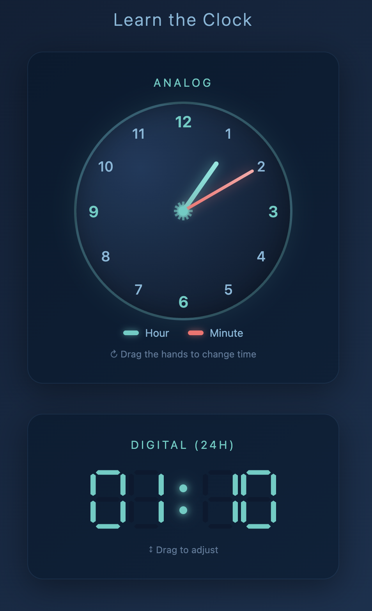

# Learn the Clock

Interactive clock learning tool to practice reading analog and digital time.



## Features

- **Analog clock** — Drag the hour or minute hand to set the time; hands and minute markers share the same center for clear alignment.
- **Digital display (24h)** — Shows the current time; drag the hour or minute group up/down to adjust, or use the mouse wheel.
- **AM/PM** — Double-click the hour hand to toggle between 12h AM/PM (display stays 24h).

## Run

Open `index.html` in a browser. No build or server required.

```bash
open index.html
```

## Tech

Single HTML file with embedded CSS and JavaScript. Works offline.
